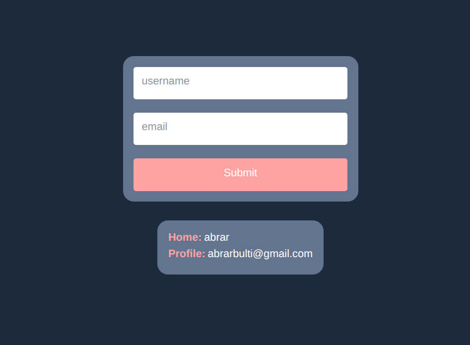

# 🧠 React Context API Demo

A simple and educational React application demonstrating the use of Context API for managing and sharing state across multiple components.

## 🚀 Features

- Centralized user state using React Context
- Live context updates with login form
- Shared data between multiple components (Home & Profile)
- Clean and minimal UI

## 🛠️ Tech Stack

- Frontend: React, Tailwind CSS
- State Management: React Context API
- Version Control: Git & GitHub

## 📸 Screenshots

---

This project is great for beginners looking to understand how Context API works in real-world React applications.
